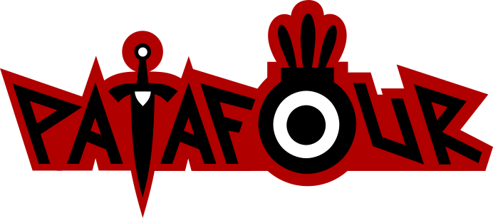

# V4Hero



An official client for Patafour.

## Table of Contents

- [Setup](#setup)
  - [Required Libraries and Tools](#required-libraries-and-tools)
  - [Linux installation](#linux-installation)
  - [Windows installation](#windows-installation)
- [Contributing](#contributing)
- [License](#license)

### Required Libraries and Tools

 * [CMake](https://cmake.org/download/) >= 3.19
 * [Git](https://git-scm.com/downloads)
 * [SFML](https://www.sfml-dev.org/download.php) >= 2.5
 * [Discord Game SDK](https://dl-game-sdk.discordapp.net/2.5.6/discord_game_sdk.zip)
 
## Setup

Simply clone the repo and CMake should automatically grab everything for you, if your IDE supports it.

Visual Studio Community 2019+, Visual Studio Code and CLion generally should work just fine. 

Code::Blocks and others haven't been tested and probably won't work.

### Compiler

GCC is used to compile Patafour alongside with it's required libraries. C++20 support is required.

MSVCRT runtime should work. [UCRT runtime won't work.](https://en.sfml-dev.org/forums/index.php?topic=28265.0)

### Linux installation

You need to have all the libraries necessary to compile SFML in order to compile Patafour. It all depends on the flavor of Linux you're using.

For Ubuntu-based systems (which the project is developed on) these libraries should satisfy all the build requirements:

```sudo apt install build-essential libx11-dev libxrandr-dev libxcursor-dev libgl1-mesa-dev libudev-dev libopenal-dev libvorbis-dev libflac-dev libfreetype-dev libfreetype6 libfreetype6-dev zlib1g-dev libzip-dev liblzma-dev libbz2-dev```

Builds are known to work on NVIDIA systems without issues. AMD probably works as well, further tests are needed. Intel GPU support is unknown.

### Windows installation

After building, an error may appear in relation to a missing OpenAL32.dll. You can simply copy it from SFML/bin folder to V4Hero.exe directory. The same thing applies to a missing discord_game_sdk.dll, which can be copied from the lib folder within Discord Game SDK package.

Make sure that you select proper architecture of the libraries. If you're experiencing a 0xC000007B error, that means the architecture of either OpenAL32.dll or discord_game_sdk.dll does not match the target architecture you're compiling V4Hero at.

[SFML has issues building on UCRT runtime.](https://en.sfml-dev.org/forums/index.php?topic=28265.0) Please make sure that your compiler uses MSVCRT runtime.


## Contributing

PRs are welcome.

The developer team and the wider community around Patafour hangs out on [Discord](https://discord.gg/dawfDyM), 
and we use that to coordinate the efforts around development. 

Please contact the developer team on Discord if you intend to make wide changes to the game code, otherwise feel free to open issues or send PRs!


## 3rd-party credits

  * [SFML](https://github.com/SFML/SFML) - multimedia library holding the project together
  * [nlohmann/json](https://github.com/nlohmann/json) - wonderful and simple json support
  * [gabime/spdlog](https://github.com/gabime/spdlog) - much better and more detailed logs
  * [ctabin/libzippp](https://github.com/ctabin/libzippp) - .zip file support


## License

GPL-3.0 (c) the Patafour team
